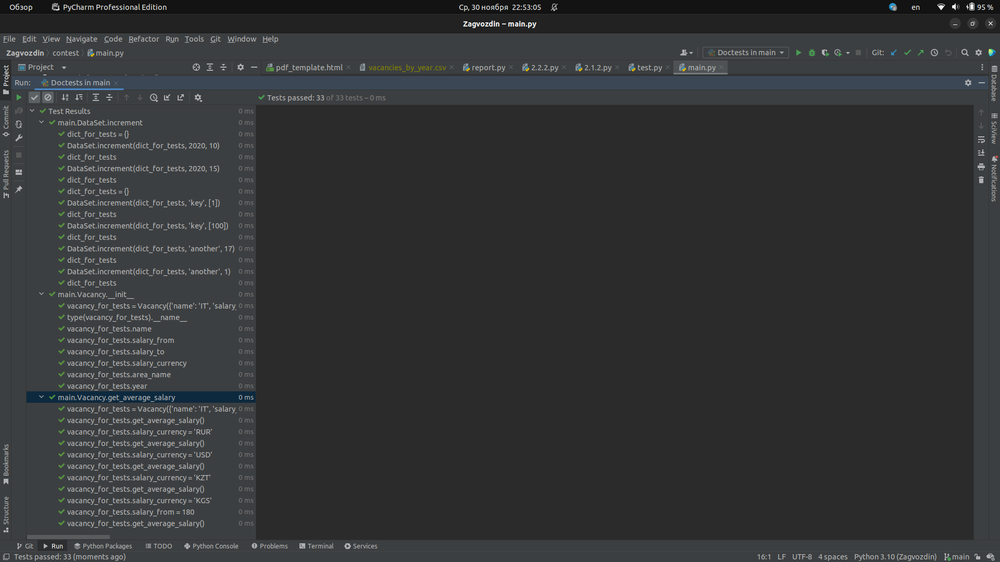
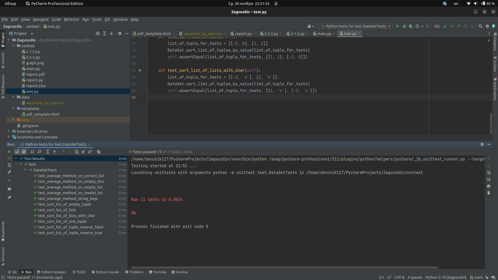
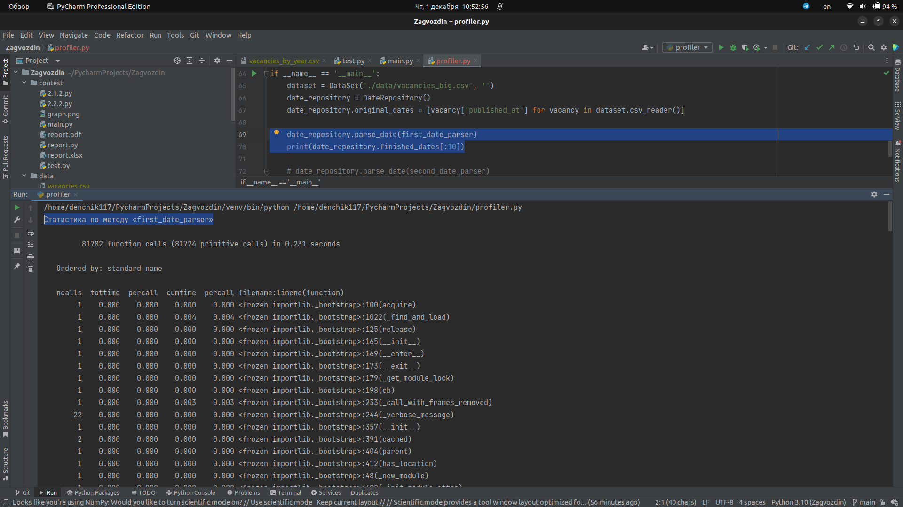
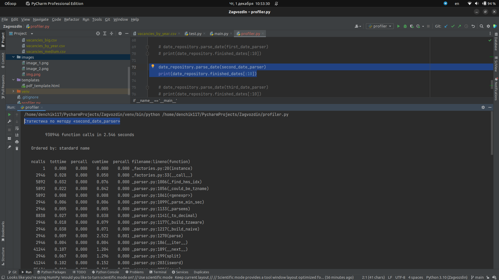
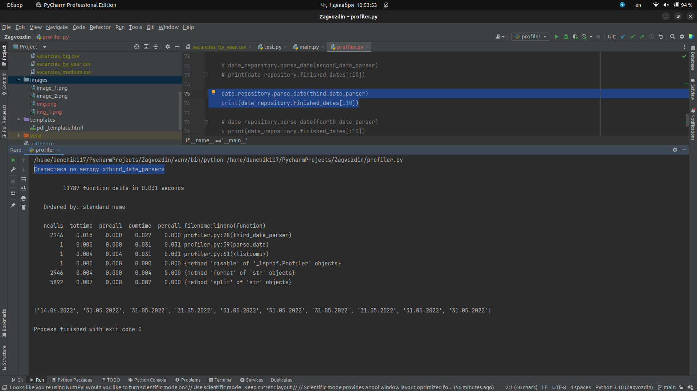
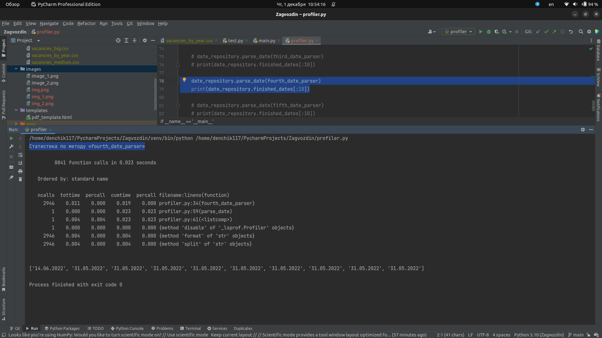
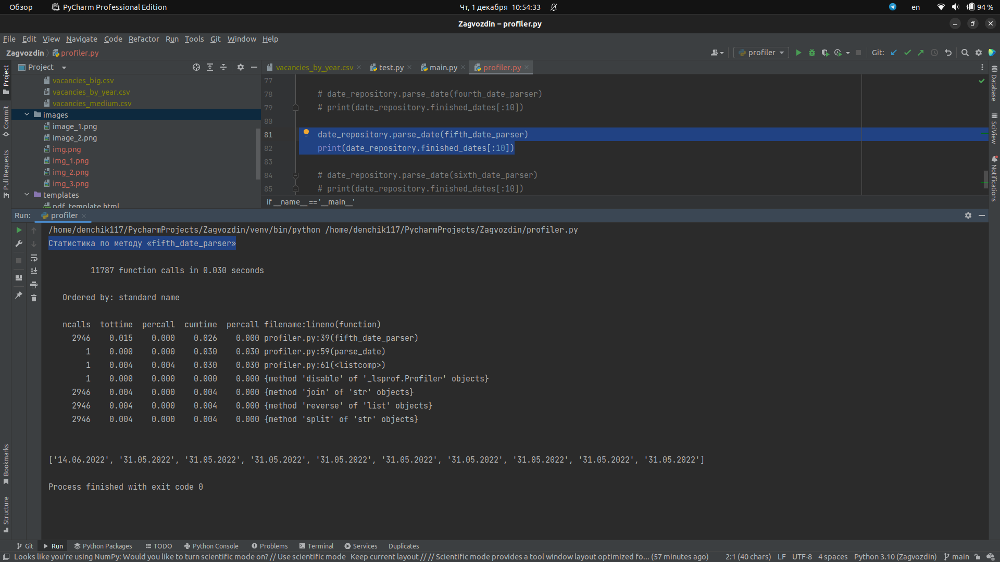

## Репозиторий с заданиями с ELearn

### Тестирование

Сделал тестирование на doctest и модульных тестах.

5 методов протестировано в файле `main.py`.
3 метода протестировано _доктестами_, 2 метода ― _модульными тестами_.
Все пограничные случаи учтены.

#### doctests

#### Модульные тесты

### Профилирование

Сделал профилирование 6 методов для обработки сырой даты в формат `dd.mm.YYYY`.
По итогам профилирования самым эффективным и быстрым методом оказался `fourth_date_parser()`.
Остальные методы закомментировал, оставил только самый эффективный.
Результаты профилирования прикрепляю ниже.

#### first_date_parser()

#### second_date_parser()

#### third_date_parser()

#### fourth_date_parser()

#### fifth_date_parser()

#### sixth_date_parser()

