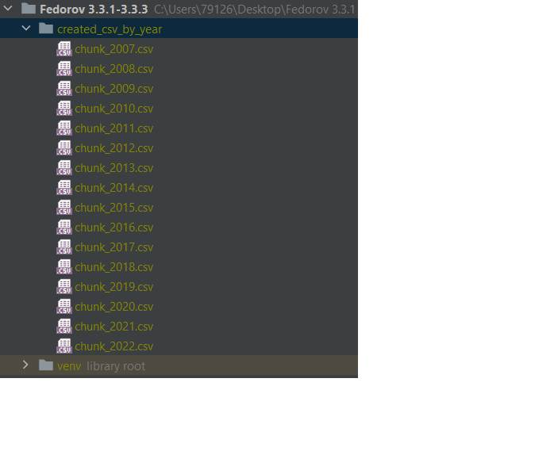

 - Задача 3.2.1

 - Задача 3.2.2

Замер с многопроцессорной обработкой

Замер без многопроцессорной обработки

 - Задача 3.2.3

Замер с многопроцессорной обработкой при помощи Concurrent futures. Выполняется быстрее, выбираем это решение.

 - Задача 3.3.1 (файл есть в репозитории)

 - Задача 3.3.2 (вывод в консоль, файл есть в репозитории)

 - Задача 3.3.3

